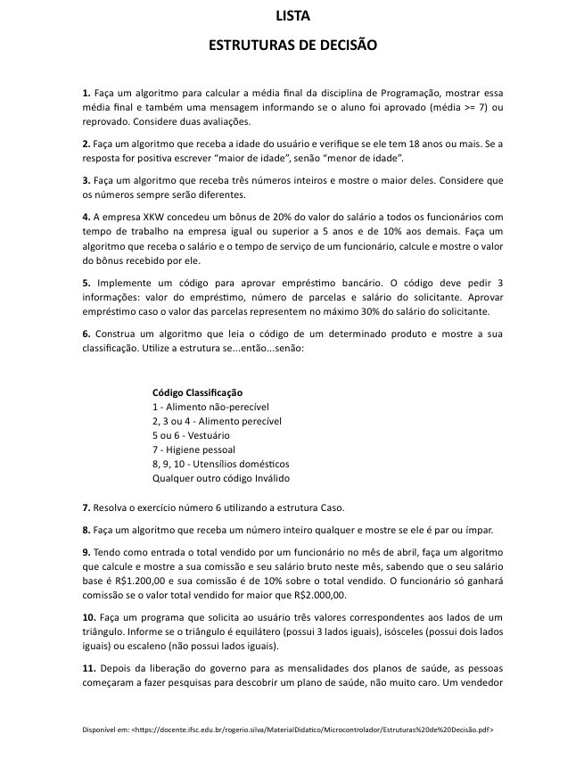
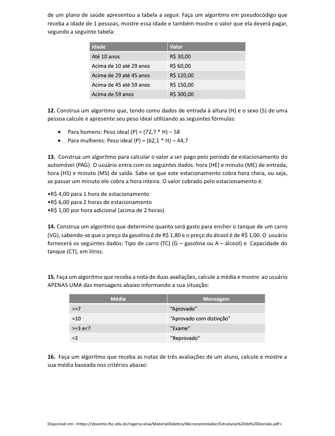
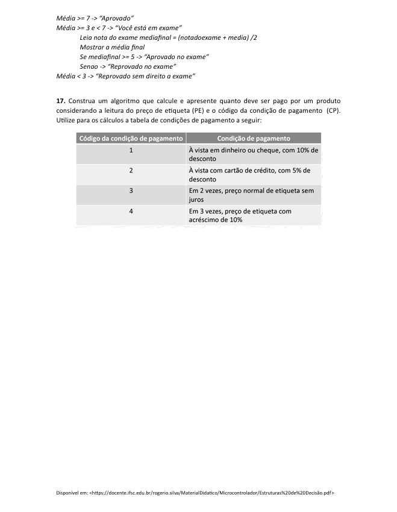

# ☕ Decisão Condicional em Java

Repositório contendo exercícios de **estruturas de decisão em Java**, abordando o uso de `if`, `else` e `switch`.

Os exercícios foram desenvolvidos durante o **3º período do curso de Engenharia de Software na Faculdade de Nova Serrana (FANS)**, na disciplina de **Programação Orientada a Objetos**.

---

## Atividades Propostas

### Parte 1

### Parte 2

### Parte 3

---

## Tecnologias utilizadas

- Java
- Lógica de programação
- Estruturas condicionais

---

## Objetivo

Praticar a construção de algoritmos utilizando **estruturas de decisão**, fundamentais para o desenvolvimento de sistemas em Java.

---

## Autor
**Matheus Pereira**   
- Estudante de Engenharia de Software Faculdade de Nova Serrana  
- Apaixonado por desenvolvimento desktop  
- GitHub: https://github.com/MatheusPereiira

